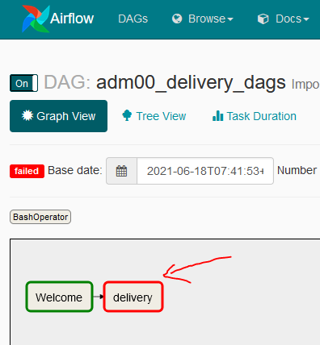
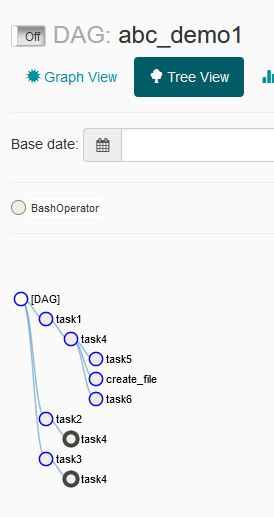

# Airflow

This page explains how to use [Airflow](https://airflow.apache.org/) to schedule the launch of a job (see [documentation](https://airflow.apache.org/docs/apache-airflow/1.10.7/)).

Airflow is a task scheduler with the following main functionalities:
* dependencies between tasks
* automatic retry in case of failure
* manage job from web interface (run job or specific task, visualize log)

## Table of contents

<!--ts-->
   * [Quick overview](#1-quick-overview)
   * [Template for data project](#2-template-for-data-project)
   * [Environments](#3-environments)
   * [How to install/update a DAG](#4-how-to-installupdate-a-dag)
     * [Install method](#41-install-method)
     * [Install troubleshoot](#42-install-troubleshoot)
   * [Web interface usage](#5-web-interface-usage)
     * [Activate the DAG](#51-activate-the-dag)
     * [Detail page](#52-detail-page)
     * [Task options](#53-task-options)
     * [Delete a DAG](#54-delete-a-dag)
   * [Best practices & hint](#6-best-practices--hint)
     * [Restrictions](#61-restrictions)
     * [Relaunch a task after a fail](#62-relaunch-a-task-after-a-fail)
     * [Define dependencies between tasks](#63-define-dependencies-between-tasks)
<!--te-->


## 1. Quick overview

Airflow is organized around two main principles:
- a **DAG**: a representation of the dependencies between multiple tasks
- an **Operator**: a task defined by an id and a command

Here is an example of a DAG with dependencies between operators (tasks).


A DAG is described by Python script.

Here is an example of a DAG with two tasks: t1 and t2 which runs sequentially.
This DAG runs every day.

```python
with DAG(
    'My DAG',
    description='A simple DAG',
    schedule_interval=timedelta(days=1),
    start_date=days_ago(2),
) as dag:

    t1 = BashOperator(
        task_id='print_date',
        bash_command='date',
    )

    t2 = BashOperator(
        task_id='sleep',
        bash_command='echo Hello there',
        retries=3,
    )
    t1 >> t2
```

A DAG is defined by:
* **an id**: the name of the python file without the extension
* **a description**
* **a start date** which corresponds to the first launch

:warning: **WARNING:** The default Airflow timezone is UTC, it is then necessary to specify the timezone
in the START_DATE before setting the schedule interval. **DO NOT USE** the library airflow.utils.dates.days_ago
to set the start date. Set the date in hard and in the past.
```python
local_tz = pendulum.timezone('Europe/Amsterdam')
START_DATE = datetime(2021, 7, 1, tzinfo=local_tz)
```

* **a periodicity** at which it must be launched, see [schedule_interval](https://airflow.apache.org/docs/apache-airflow/1.10.1/scheduler.html#dag-runs)

:warning: **WARNING:** **DO NOT USE** preset for periodicity (like @daily, @weekly, etc.), only the cron syntax must be used.
```
# Cron syntax

# minute   hour   day of month       month          day of week        command
# (0-59)  (0-23)     (1-31)    (1-12 or Jan-Dec)  (0-6 or Sun-Sat)

# Execution every day at 10am
# 0 10 * * *
```

* Several tasks defined by:
  * **an operator**: BashOperator to launch a bash command for example
  * **an id**: a string with no space


* The dependencies between the tasks


## 2. Template for data project

The DAG definition must be written in a file respecting the following naming rules **brcXX_prdXX_[some_text].py**:
* it must start with the **BRCXX** that contains the project
* followed by the **PRDXX** of the project (separated by an underscore)
* an optional text (separated by an underscore)

For example, the CVH00 project belonging to BRC01 will have the name **brc01_cvh00_standardization.py**

The following DAG is the template which can be found under [airflow/brc14_app00_template.py](airflow/brc14_app00_template.py).

:warning: **WARNING:** only simple quotes must be used in the DAG, do not use double quotes otherwise the installation will failed.


## 3. Environments

There are two Airflow environments available for the DataLab:
* development
  * Directory for delivery: `/gpfs/user/airflow_dev/delivery/dag`
  * Airflow console : http://ylalz3y0.inetpsa.com:8089
* production
  * Directory for delivery: `/gpfs/user/airflow/delivery/dag`
  * Airflow console : http://ylalz4z0.inetpsa.com:8088

When developping a DAG, the development environment must be used to test it.

Once the DAG works as expected, it can be installed on the production environnement.


## 4. How to install/update a DAG

### 4.1 Install method
The process described below is only valid for the DataLab environment. The directory and console indicated are those of the development environment.
To install in the production environment, you just have to use the production settings instead of the development ones.

To install or update a DAG the method is the same.

0. Log in to the BRCXX related to the project using the technical account MWPBRCXX
(Applicative Service BRCB.BRCXX) and clone the project.

1. Copy the DAG file (python script) into the delivery directory
```
cp airflow/brc14_app00_template.py /gpfs/user/airflow_dev/delivery/dag
```

2. Connect to the [Airflow console](http://ylalz3y0.inetpsa.com:8089) using the technical account (MWPBRCXX) that has the right to write on the corresponding BRC.

3. Run the dag **adm00_delivery_dags**. It scans the delivery directory and install all new DAGs. By default it's launched once per day.


After a few minutes, the new DAG must appear in the list (if there is no problem in the DAG definition).

The delivery DAG checks whether the format of the DAG is correct (compliance with certain rules) and performs an impersonalisation of the command. The impersonalisation corresponds to the transformation of the bash command to be able to run it using the technical account (it encapsulates the command in a **sudo** command).

### 4.2 Install troubleshoot
If the installation fails, the error can be found in the log of the delivery DAG.

Select the failed job and the task in error. Then select **View Log**.




Once the DAG fixed, please go back to the [3.1. section](#31-install-method) to update the DAG in the delivery directory.

## 5. Web interface usage

### 5.1 Activate the DAG

By default, when a DAG is newly installed, it is deactivated. Activate it from the DAG list:


Or from the detail page of the DAG:


### 5.2 Detail page

In the detail page there are mainly 4 interesting features:
1. The **graph view** which shows the dependencies between tasks in a graph and the result of the last run (the color surrounding the boxes).


2. The **tree view** which shows the dependencies between tasks in a tree and the result of all previous runs.

 

3. The **code** tab which shows the python code which will be run.


4. The **Trigger DAG** button which allows to manually launch the DAG.


### 5.3 Task options

When selecting a task (in graph view or tree view) there are multiple options:
* view the log
* run the task
* clear the task
* mark the task failed
* mark the task success

The last 3 options (clear and mark) are used to relaunch the task especially after a fail.


### 5.4 Delete a DAG

To delete a DAG, it must be deactivated first, then click on button **Delete**.


## 6. Best practices & hint

### 6.1 Restrictions

There are some restrictions:
1. To launch a DAG, you must use a **technical account (MWPBRCXX)** that has the right to write on the corresponding BRC (Applicative Service BRCB.BRCXX). A personnal account can not run DAG even if it has access to the BRC.
2. All operators (see [list of operators](https://airflow.apache.org/docs/apache-airflow/1.10.7/concepts.html#concepts-operators)) can be used in Airflow with one restriction:
   * They will be executed with the **airflow** user. That means it has restriction right (no BRC access for example)
   * Only the **BashOperator** (i.e. a bash command) will be run using a specific account (MWPBRCXX) which can access to the BRC.
3. A task can not be instantiated dynamically. All tasks must be implemented.
4. The bash command must be defined externally in a variable (not directly in the bash_command).
5. The right to execute a DAG is centralized by BRC. A user which created a DAG on BRC01 will have the right to launch all DAGs on this BRC.
By default, a user has only the right to view DAGs but not to execute one. He must create or update a DAG linked to a BRC to have the execution right.
6. :warning: **WARNING:** Any user can update a DAG by overwriting it.

### 6.2 Relaunch a task after a fail

When a task failed, it's marked in red.

To relaunch the task, it must be cleared. Once cleared, the scheduler will relaunch the task (after a few moments).

If the task must be skipped to allow next task to run, it must be marked as success.

:warning: **WARNING:** It's not because a task failed that the DAG will stop. It mainly depends on the parameters **trigger_rule** (see [concepts-trigger-rules](https://airflow.apache.org/docs/apache-airflow/stable/concepts/dags.html#concepts-trigger-rules)) and **depends_on_past**.


### 6.3 Define dependencies between tasks

To define the order of the tasks the operator **>>** and **<<** can be use.

* t1 >> t2 : launch t2 after t1
* t3 << t4 : launch t3 after t4

Tasks may also be launched in parallel. To do so, include the tasks in an array **[x, y,...]**

* [t1, t2] : t1 and t2 will be launched in parallel

With these instructions, complex schedule can be done like this one:


Described by:

    [t1, t2, t3] >> t4 >> [t5, t6, t7]

Or this one:


With this definition:

    t_extract_1 >> [t_extract_2, t_upload_1]
    t_extract_2 >> [t_extract_3, t_upload_2]
    t_extract_3 >> [t_extract_4, t_upload_3]
    t_extract_4 >> [t_extract_5, t_upload_4]
    t_extract_5 >> [t_extract_6, t_upload_5]
    t_extract_6 >> t_upload_6
