# Continuous integration

This is page explains how to organize continuous integration under **CIQ**.

The CIQ platform (CI in PSA environment) allows to build, to run unit test, to package and to deploy application among others things: [CIQ platform](http://ciq-integration.inetpsa.com)

These different phases are related to the organization of the Git branches. Please refer to this page for more information: [Git branch organization](git-branch-organization.md).

Note: In the following document, text between [] must be replaced depending on your project
- **PRD** : the PRD of the project like APP00, TCV00, etc.
- **XX**  : the ID of the corresponding BRC like 01, 06, etc.

# Table of contents

<!--ts-->
  * [Protect Git branches](#protect-git-branches)
  * [Validate Pull Request](#validate-pull-request)
  * [Deliver a development version](#deliver-a-development-version)
  * [Deliver a production version](#deliver-a-production-version)
<!--te-->

# Protect Git branches

As previously seen in [GitHub organization](git-branch-organization.md), no modification must be done directly in **master** and **dev** branches.

To avoid any mistake, these branches can be protected in GitHub.

Go to the **Settings** page of the GitHub repository, then in the menu **Branches**.

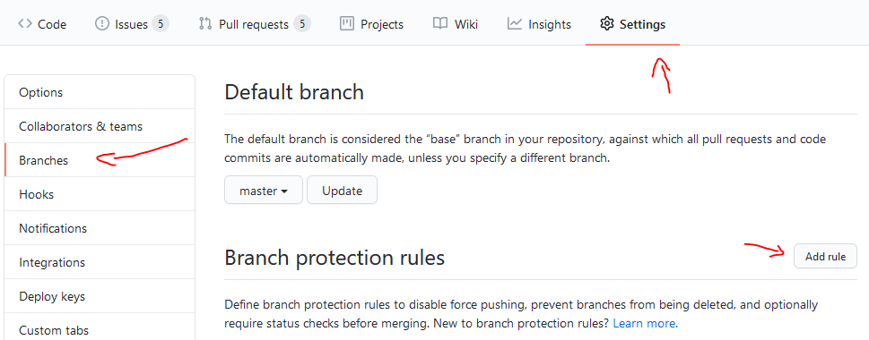

## 1. Protect the Master branch

- On previous screen, click on **Add rule** button.
- Type in the **Branch name pattern** field: **master**
- Check option **Require pull request reviews before merging**
- Check option **Require review from Code Owners**
- Then click on **Create** button

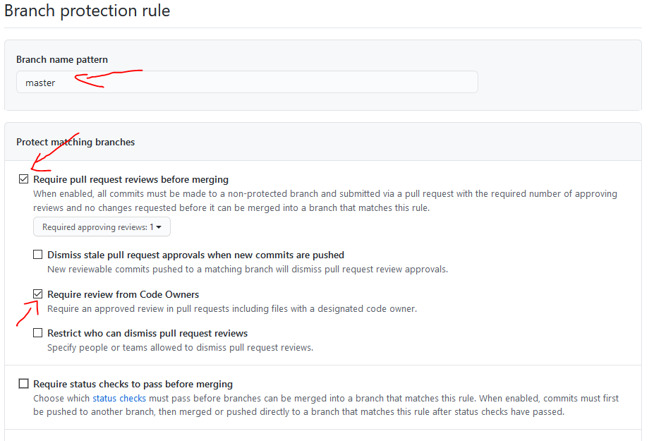

## 2. Protect the Dev branch

- Add another rule, click on **Add rule** button.
- Type in the **Branch name pattern** field: **dev**
- Check option **Require pull request reviews before merging**
- Check option **Require review from Code Owners**
- Check option **Require status checks to pass before merging**
- Check option **Require branches to be up to date before merging**
- Then click on **Create** button

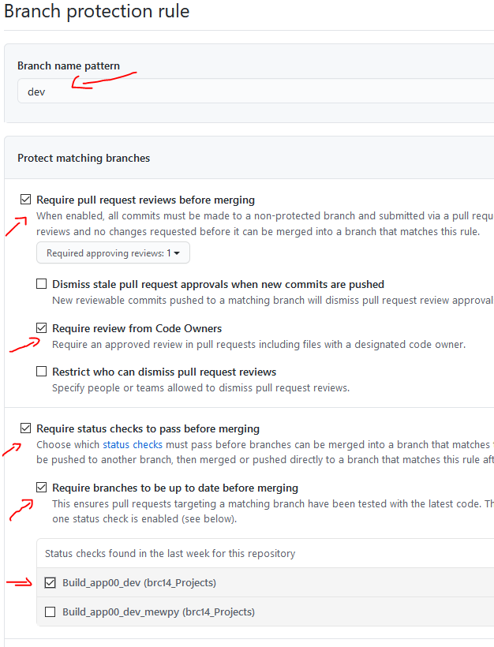

# Validate Pull Request

With CI, we can validate a pull request by running test of the project automatically.

This build is used when a pull request is done on the **development branch** (dev), it will:
* analyze the code (with SonarQube)
* test the project (run unit test)

If the tests fail, the merge of the pull request is blocked until they succeed.

For more information on branch management please refer to: [Git branch organization](git-branch-organization.md).

There are several steps to configure a build configuration to automatize launch unit test and validate a pull request.

1. Set the access to the source of the project
2. Set the build step to launch quality analyze and unit test
3. Set the trigger to automatize the launch

The example on the application template can be found here: [App Template validate pull request](http://ciq-integration.inetpsa.com/admin/editBuild.html?id=buildType:Brc14Projects_BuildApp00)

## 1. Create a new build configuration

First create a **new build configuration** in the corresponding **brc[XX]_Projects** under TeamCity:

- In the left menu, click on **brc_Projects** then **brc[XX]_Projects**
- Click on button **Edit project...**

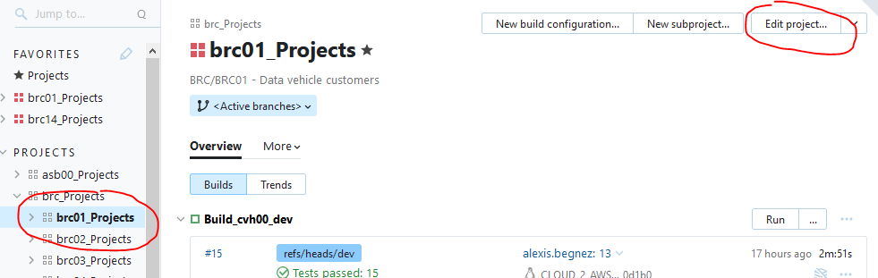

- Click on button **Create build configuration** (in "General Settings" menu):

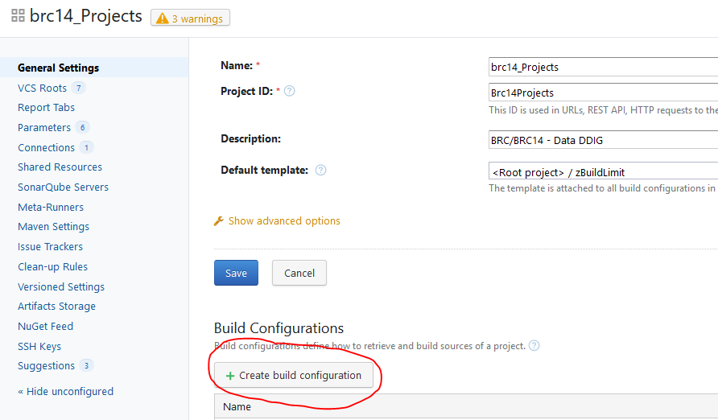

- Select **Manually** configuration
- Set name: **Build_[PRD]_dev**

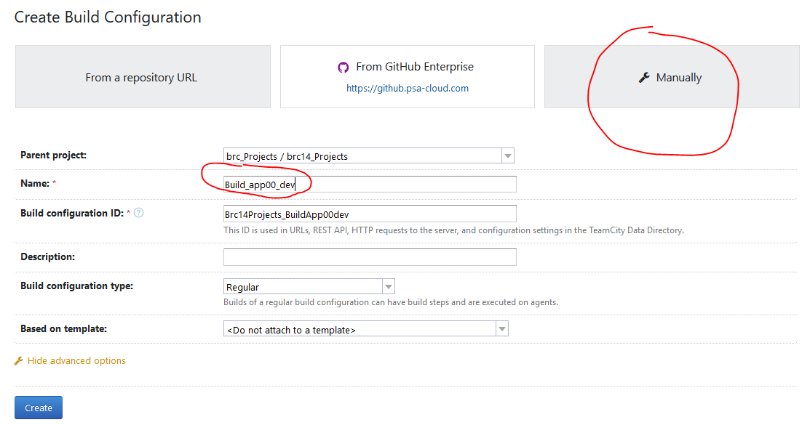

  
## 2. Set Version control settings

Now, the access to the GIT repository must be set.

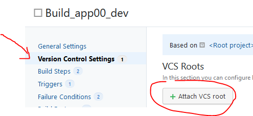

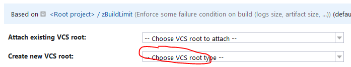

Create a new VCS root by selecting GIT.

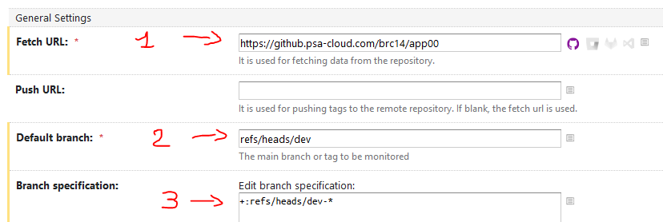

Set the Git configuration with:

1. Set VCS root name to: **[PRD]_dev**
2. The URL of the repository: **https://github.psa-cloud.com/brc[XX]/[PRD]**
3. Set the default branch to the development branch: **refs/heads/dev**
4. Set the branch specification to feature in development branch: **+:refs/heads/dev-***
5. Set the authentication method to: **Anonymous**

## 3. Create the build steps for Quality analysis

In this step, the configuration for the quality analysis will be configured. It will provide some indicators like bugs, security vulnerability, etc.

The result of the analysis will be found on SonarQube: [CIQ Quality](http://ciq-quality.inetpsa.com)

For more information, got to [CIQ Documentation](http://ciq-documentation.inetpsa.com/quickstart/sonarqube.html)

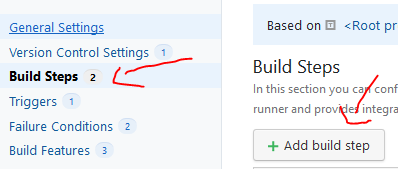

1. Set the runner type to **SonarQube Runner**
2. Set the name: **Quality**
3. Set the SonarQube Server: **Sonarqube PSA**
4. Set project name to: **%env.TEAMCITY_BUILDCONF_NAME%**
5. Set project key to: **com.inetpsa.brc[XX]:%env.TEAMCITY_PROJECT_NAME%**
6. Set Sources location: **.**

## 4. Create the build step for validating the pull request

This step will launch the tests (unit, functionnal) of the project. It uses the same configuration when they run on ARC.

The target **test** of the **Makefile** will run and the result will be displayed in the result of the build.

1. Set the runner type to **GNU Make**
2. Set the name: **Run test**
3. Set the Make tasks: **test**

## 5. Set report processing

In the previous step, the launch of the tests was set, now the results must be formatted to be readable in TeamCity.

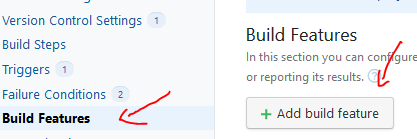

1. Add a new build feature of the type **XML report processing**.
2. Set report type to: **Ant Junit**
3. Set monitoring rules to: ****/testreport.xml**

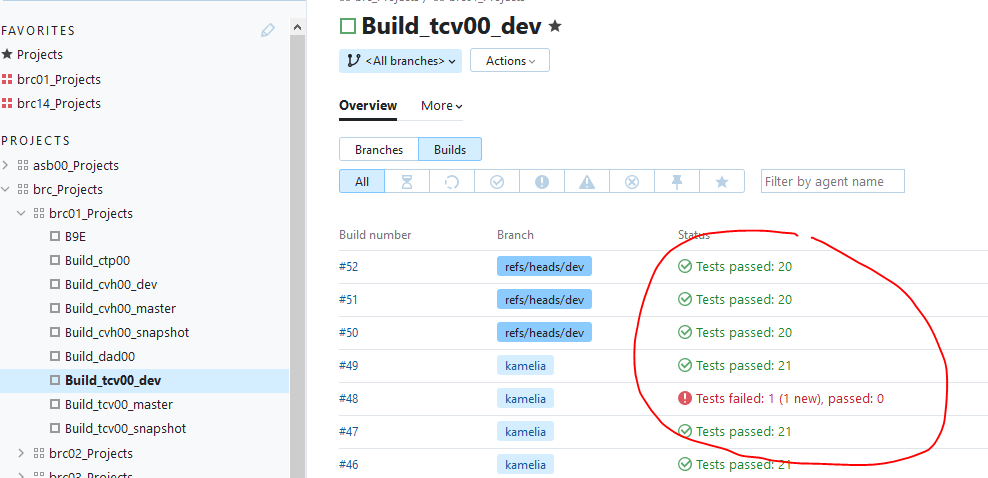

## 6. Create the trigger

The build steps are done, now the trigger must be set to allow the automatic launch of the build.

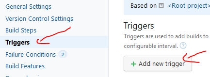

Select **VCS Trigger** and let all options to default.

## 7. Set pull request feature

Once the trigger activated, it must be configured. The principle is to watch pull requests from all **dev** branches.

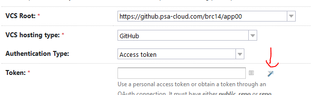

1. Add a new build feature of the type **Pull requests**.
2. Select VCS root to one created at "2. Set Version control settings" : **[PRD]_dev**
3. Set VCS hosting type to: **GitHub**
4. Set Authentication type to: **Access token**
5. Set access token by clicking on the icon **wizard wand**
6. Set by target branch to: **+:refs/pull/*/dev**

## 8. Set commit status publisher

The trigger on pull request done, now TeamCity must be allowed to change the status of the pull request (permission to merge).

1. Add a new build feature of the type **Commit status publisher**.
2. Select VCS root to one created at "2. Set Version control settings" : **[PRD]_dev**
3. Set publisher to: **GitHub**
4. Set GitHub URL to: **https://github.psa-cloud.com/api/v3**
5. Set Authentication type to: **Access token**
6. Set access token by clicking on the icon **wizard wand**

## 9. Set agent requirement

On TeamCity there are several agents with different operating systems. Data project can only run on Ubuntu agents, so it must be specified in the build.

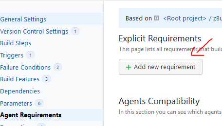

If the agent requirement below doesn't exist, create it.

1. Set parameter name to: **system.agent.name**
2. Set condition to: **contains**
3. Set value to: **Ubuntu**

## 10. Enable GitHub to trigger Teamcity

By default, TeamCity checks every hour if a change occured on git repository. If so, the build is launched.

This timer can be decreased but this will overload TeamCity. To get around this problem, GitHub can be configured to inform TeamCity that it must run a build when an action is performed (like a pull request, a push, etc.).

On the **Suggestions** menu, a suggestion about installing a webhook into the GitHub repository must appear with the url of the GitHub repository previously set (see *2. Set Version control settings*).

Click on **+ Install GitHub webhook** and that's finished.

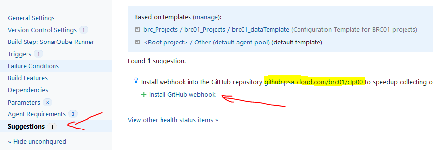

To check, go to the **Settings** page of the GitHub repository.

On the **Hooks** menu, a webhhok must appeared starting by : **http://ciq-integration.inetpsa.com/app/hooks/github**

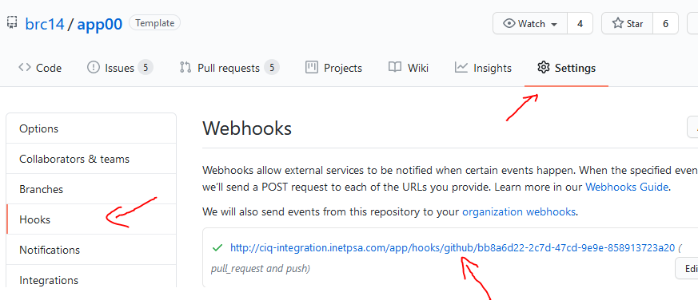

# Deliver a development version

Delivering a development version consists of creating the application (aka the package) and making it available (aka deploying it on a repository or on a server) from the development branch.

As it will be used only for testing purpose, this build is based on **development branch** and will be **launched manually**. The version of the package will always be **snapshot**.

For data projects, the deployment of the application is to make it available on Artifactory repository: [PSA Artifactory repository](http://repository.inetpsa.com/webapp/#/artifacts/browse/tree/General/pypi-virtual)

Follow the steps below to deliver a development version:

1. Set the access to the source of the project (the development branch)
2. Set the build step to package and upload the project

The example on the application template can be found here: [App Template build snapshot](http://ciq-integration.inetpsa.com/admin/editBuild.html?id=buildType:Brc14Projects_BuildApp00snapshot)

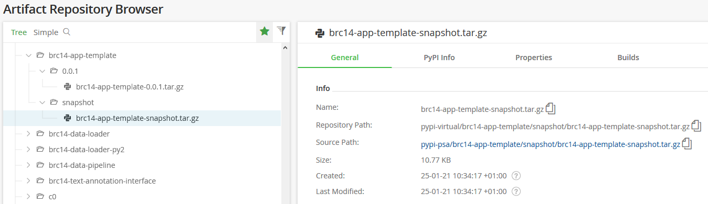

## 1. Create a new build configuration

First create a **new build configuration** in the corresponding **brc[XX]_Projects** under TeamCity:

- In the left menu, click on **brc_Projects** then **brc[XX]_Projects**
- Click on button **Edit project...**
- Click on button **Create build configuration** (in "General Settings" menu):
- Select **Manually** configuration
- Set name: **Build_[PRD]_snapshot**
  
## 2. Set Version control settings

Now, the access to be GIT repository must be set.


Create a new VCS root by selecting GIT.

Set the Git configuration identical to validate a pull request except for:


1. Set VCS root name to: **[PRD]_snapshot**
2. The URL of the repository: **https://github.psa-cloud.com/brc[XX]/[PRD]**
3. Set the default branch to the development branch: **refs/heads/dev**
4. Set the authentication method to: **Anonymous**

## 3. Create the build steps for Quality analysis


1. Set the runner type to **SonarQube Runner**
2. Set the name: **Quality**
3. Set the SonarQube Server: **Sonarqube PSA**
4. Set project name to: **%env.TEAMCITY_BUILDCONF_NAME%**
5. Set project key to: **com.inetpsa.brc[XX]:%env.TEAMCITY_PROJECT_NAME%**
6. Set Sources location: **.**

## 4. Create the build step to test the development branch

1. Set the runner type to **GNU Make**
2. Set the name: **Run test**
3. Set the Make tasks: **test**

## 5. Create the build step to package the project

1. Set the runner type to **GNU Make**
2. Set the name: **Create snapshot**
3. Set the Make tasks: **snapshot**

## 6. Create the build step to deploy the package to Artifactory (with Twine)

1. Set the runner type to **Command Line**
2. Set the name: **Deploy snapshot to artifactory**
3. Set the custom script to:
```
. .venv3/bin/activate
pip install twine
twine upload -u %twine_us% -p %twine_pwd% --repository-url http://repository.inetpsa.com/api/pypi/pypi-virtual dist/*
```

## 7. Add configuration parameters

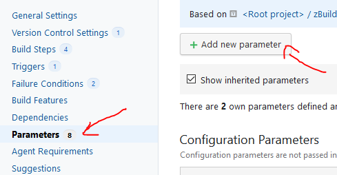

In the parameters of the build add the account used in Twine. The account is a functionnal account set in TAM for the project.

1. Create the configuration parameter **twine_us** with: **MWPBRC[XX]**
2. Create the configuration parameter **twine_pwd** with the type **password** (Spec->Edit->Type) to: **[password]**

## 8. Set report processing

1. Add a new build feature of the type **XML report processing**.
2. Set report type to: **Ant Junit**
3. Set monitoring rules to: ****/testreport.xml**

## 9. Set agent requirement


1. Set parameter name to: **system.agent.name**
2. Set condition to: **contains**
3. Set value to: **Ubuntu**

# Deliver a production version

Delivering a production version consists to create the application (aka the package) and to make it available (aka to deploy it on a repository or on a server).

For data projects, the deployment of the application is to make it available on Artifactory repository: [PSA Artifactory repository](http://repository.inetpsa.com/webapp/#/artifacts/browse/tree/General/pypi-virtual)

As to validate a pull request there are the same steps to deliver a production version:

1. Set the access to the source of the project
2. Set the build step to package and upload the project
3. Set the trigger to automatize the launch (when tagging the master branch)

The example on the application template can be found here: [App Template production version](http://ciq-integration.inetpsa.com/admin/editBuild.html?id=buildType:Brc14Projects_BuildApp00prod)

## 1. Create a new build configuration

First create a **new build configuration** in the corresponding **brc[XX]_Projects** under TeamCity:

- In the left menu, click on **brc_Projects** then **brc[XX]_Projects**
- Click on button **Edit project...**
- Click on button **Create build configuration** (in "General Settings" menu):
- Select **Manually** configuration
- Set name: **Build_[PRD]_master**
  
## 2. Set Version control settings


Create a new VCS root by selecting GIT.

Set the Git configuration identical to validate a pull request except for:


1. Set VCS root name to: **[PRD]_master**
2. The URL of the repository: **https://github.psa-cloud.com/brc[XX]/[PRD]**
3. Set the default branch to the development branch: **refs/heads/master**
4. Set the branch specification to feature in development branch: 
```
+:refs/tags/*
-:refs/(pull/*)/merge
```
5. Enable **Use tags as branches**
6. Set the authentication method to: **Anonymous**

## 3. Create the build step to test the master branch

1. Set the runner type to **GNU Make**
2. Set the name: **Run test**
3. Set the Make tasks: **test**

## 4. Create the build step to package the project

1. Set the runner type to **GNU Make**
2. Set the name: **Create distribution package**
3. Set the Make tasks: **dist**

## 5. Create the build step to deploy the package to Artifactory (with Twine)

1. Set the runner type to **Command Line**
2. Set the name: **Deploy package to artifactory**
3. Set the custom script to:
```
. .venv3/bin/activate
pip install twine
twine upload -u %twine_us% -p %twine_pwd% --repository-url http://repository.inetpsa.com/api/pypi/pypi-virtual dist/*
```

## 6. Add configuration parameters


In the parameters of the build add the account used in Twine. The account is a functionnal account set in TAM for the project.

1. Create the configuration parameter **twine_us** with: **MWPBRC[XX]**
2. Create the configuration parameter **twine_pwd** with the type **password** (Spec->Edit->Type) to: **[password]**

Add the configuration parameter to run the build even if there is no change in the code (only tag):

3. Set the name to **teamcity.vcsTrigger.runBuildInNewEmptyBranch** and value to **true**


## 7. Create the trigger


Select **VCS Trigger** and set branch filter to:
```
+:*
-:<default>
```

## 8. Set report processing

1. Add a new build feature of the type **XML report processing**.
2. Set report type to: **Ant Junit**
3. Set monitoring rules to: ****/testreport.xml**

## 9. Set agent requirement


1. Set parameter name to: **system.agent.name**
2. Set condition to: **contains**
3. Set value to: **Ubuntu**

## 10. Enable GitHub to trigger Teamcity

By default, TeamCity checks every hour if a change occured on git repository. If so the build is launch.

This timer can be decreased but this will overload TeamCity. So GitHub can be configured to inform TeamCity that it must run a build when an action is performed on the repository (like a pull request, a push, etc.).

To do so, go on the menu **Suggestions**. On this screen a suggestion about installing a webhook into the GitHub repository must appear with the url of the GitHub repository previously set (see *2. Set Version control settings*).

Click on **+ Install GitHub webhook** and that's finished.
