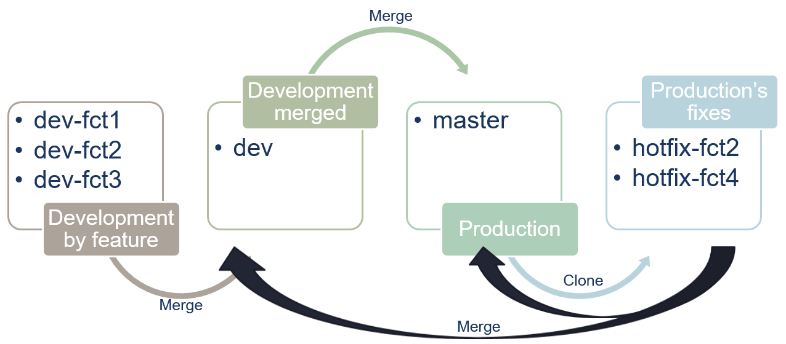
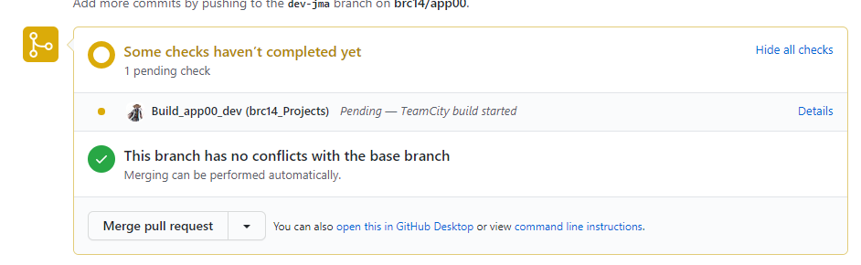
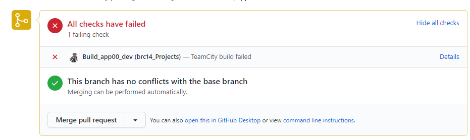
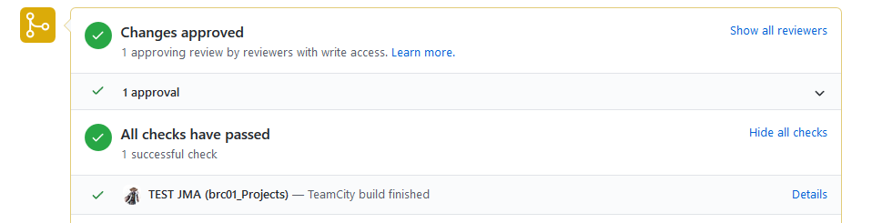
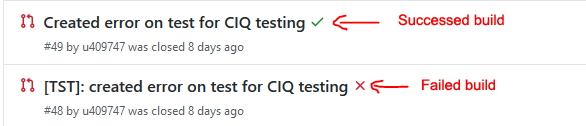

# GitHub organization

This is page explains how to organize data science projects under [GitHub](https://github.psa-cloud.com).

# Table of contents

<!--ts-->
   * [GitHub organization](#github-organization)
      * [Rules to follow](#rules-to-follow)
      * [Branches usage](#branches-usage)
      * [Propagation of changes](#propagation-of-changes)
      * [Developing a new feature](#developing-a-new-feature)
      * [Create a production version](#create-a-production-version)
      * [Patching the production](#patching-the-production)
<!--te-->

## Rules to follow

- **Master branch**: it's the production version of the project. Never to development directly on this branch
- **Never user "git push -force"**: this overwrite code on the server (no history so no rollback)
- **One devlopment branch by feature**: when working on a feature create a new branch for the development branch specific to this feature (no conflict from others developments).
- **Merge to master**: Merging from the development branch must be done only when this branch is fully tested and stable. Remember that the master branch is the code which goes on production
- **Bug on master branch**: when a bug is discovered on production (so in the master branch), a hotfix branch must be created from the master branch and the fix developed on it. Once it's done, the hotfix branch must be merged on master and on developement branch.
- **if a commit on master brokes the application** prefer do a **git commit --amend** instead of a second commit with a comment like "Bug fix". With avoid breaks the application between two commits.
- **Release on new version**: releasing a new version of the application corresponds to tag the master branch with a new number. The rule is to follow the best practice with the format **X.Y.Z** (please refer to [Software versioning](https://en.wikipedia.org/wiki/Software_versioning) for more detail).

## Branches usage

Here is an overview of the branches' organization from the best practices.

The reposity is based on 2 main branches:
- **master**: this is the production branch. It must contain only code which gies on production. Each version is differentiated by a tag under the form **X.Y.Z**.
- **dev**: the development branch. It contains all new developments which must be stable.

With these 2 branches, there are 2 types of optionnal branches:
- **feature development** branches: **dev-fctX** on the diagram. The branches correspond to a new feature under development.
- **hotfix** branches: **hotfix-fctX** on the diagram. The branches correspond to a critical bug found on production.

## Propagation of changes

The flow of updates is distinct depending of theirs purposes:
- For a development the flow is : 
  - Create a branch **dev-fctX** from **dev**
  - Developp on **dev-fctX** then merge to **dev** and finally merge **dev** to **master**
- For a bugfix in production, it's: dev-fctX to dev then to master
  - Create a branch **hotfix-fctX** from **master**
  - Developp on **hotfix-fctX** then merge to **master** and to **dev**

## Developing a new feature

No development must be done directly on the main development branch (*dev*). This is to prevent dead lock between differents development (features or developpers).

When a new feature has to be developed, a new branch under the form **dev-[feature's name]** must be created from the **dev** branch.

Regularly, commit and push on this **dev-fctX** branch.

Once the development of the feature is stable, a pull request must be done to the **dev** branch. Then with the CI configured (see [Validate Pull Request](#validate-pull-request)) the pull request will be validated is unit tests run successfully.
- if success, the pull request can be merged
- if failure, the merge is blocked until the build runs successfully

Pull request waiting for the result of the build:

The merge button in the pull request is blocked because of the failed build:

The merge is available because of the build finished successfully:

The build badge on the push request list:

## Create a production version

When the development is done (on the **dev** branch) and a production version must be released, a pull request has to be done from the development (**dev** branch) to the production (**master** branch).

As for integrating a development feature in the **dev** branch, a build in the CI is triggered to launch unit tests on the **dev** branch to validate the pull request (see [Validate Pull Request](#validate-pull-request)).

Once the merge is done, tag the **master** branch with the version **X.Y.Z**.

The tag will trigger a build in CI which package and deploy the project on artifactory.

## Patching the production

In the case of a critical bug in production, the proccess is:
- create a new branch from the **master** named **hotfix-[version|name|bug|id]**
- once the bug is fixed, the **hotfix** branch must be merged by pull request to the **master** branch and the **dev** branch.
- then deliver a new production version (with a new tag **X.Y.Z+1**).
